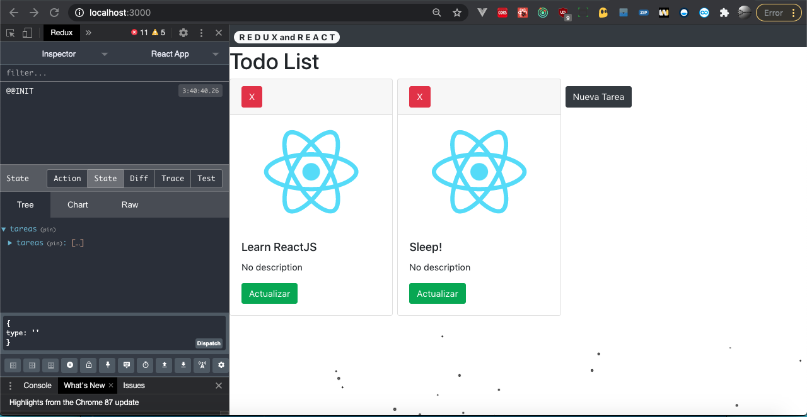

# [Basic Example REACT-REDUX](https://github.com/danielm2402/particles-redux)

## Features

* [React-redux]
* [React-Router]
* [React-particles]

## Install

Construction and testing of the project requires [node.js](http://nodejs.org/download/). `npm install -g npm@latest`.

Run project:

1. `npm run start`

